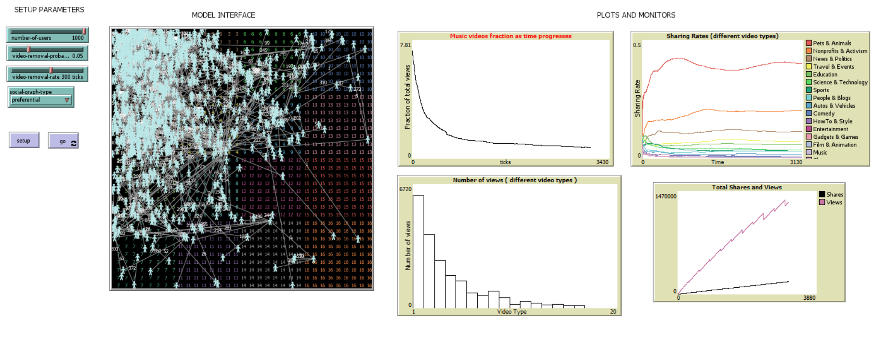

# Viral-Videos ⭐

Viral video are the videos that become popular through sharing via the internet.
The sharing of videos on social sites has given rise to this phenomenon. In this
paper we seek to understand the spread of viral content on social media via the
methods of diffusion of information, and try to answer question like: 
- What kind of social network graph has what kind of effect on the sharing and virality of a video?
- Which model is the real world social graph closest to? 
- What factors (social and non-social) contribute to a virality of content/video? what pushes people to share watch the content? 
- What interactions between content and user compels the users to watch the it? etc.

The model is based on real-world phenomenons found in the real world social media networks.We try to find the viewership and sharing patterns of different type of videos, and compare them with the pre-existing results found in the real world social media networks. These patterns show emergent patterns as well, allowing us to comment on various parameters which generated such patterns.

Refer [here](./files/Viral_Content_Presentation.pdf) for **Project presentation** of the model.

Refer [here](./files/Viral_Video_Research_Paper.pdf) for **Research Paper** of the model.


#
## Codebase Directory Architecture: 📁
#
```
content_viral
├─ README.md
├─ files
│  ├─ An analysis of emotional contagion and Internet memes.pdf
│  ├─ Catching a Viral Video.pdf
│  ├─ Viral Content Presentation.pdf
│  ├─ Viral_Video_Research_Paper.pdf
│  └─ viral_video-experiment-spreadsheet.csv
├─ viral_ext1.nlogo
├─ viral_ext2.nlogo
└─ viral_video_final.nlogo
```
## Model Summary 🔥

The emergence of online video sharing sites and social networking have enabled users across the world to create and consume content and videos. However, the sheer volume of available videos makes it difficult for users to decide what to watch(Broxton,2010). As a result, people have come to rely on their social networks to provide viewing choices. They are more likely to watch videos that are distributed from person to person across social networking sites(Broxton,2010). How exactly does videos go viral, what are the social contents of the video that go viral, what other factors contribute to the virality of a video? Is any extenal effect playing role in videos becoming viral? 
 
The above are some questions which I would explore and address via the model I propose. The model is an Agent Based Model (ABM). Why is ABM a good choice for modelling virality? There are a number of factors why ABM is the best choice for this model. In ABM aggregate behaviour knowledge is not required apriori. ABM also incorporates probability versus determinism with balance and flexibility. It can generate new hypothesis. Apart from these, ABM is very good at modelling stochastic behaviour and agent environment interactions. In this specific model, the agents are the users and the environment is the web (i.e the videos).

This model has a lot of practical applications and is quite relevant in the real world scenarios. There are millions of people who have jobs directly related to the phenomenon of virality. There are millions of agencies and companies running whose sole purpose is to create viral ads, videos for their customers. Peopleeven love watching viral videos, and a lot of companies try to associate themself in  order to promote their products. The ad-technique is already a very large industry, and thus knowing the parameters that can affect the virality is becoming a billion dollar business.

## Model and Instructions to run 🔥
- The model has documentation in ODD protocol, which can be found in the info tab of the model. 
- This model has been created in netlogo version 6.2. Kindly download netlogo 6.2 and use it to run the model 


